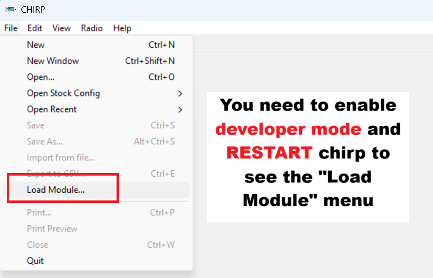

# Chirp driver for the Wouxun KG-UVR5

This repo consists of a chirp driver for controlling the Wouxun KG-UVR5 radio

----

To run it, please follow this instructions:

1 - Make sure you have a **recent** version Chirp. You can download the latest version from its [official site](https://chirpmyradio.com/projects/chirp/wiki/Download#)

2 - Download the kg-uvr5 driver from [here](https://github.com/SatcomRadio/wouxun_kguvr5_chirp_driver/blob/main/kguv920pa.py)

You need to press this button to download the file

3 - Open Chirp and enable developer mode

4 - Press ok on the warning and **restart** Chirp. Close the program and open it again

5 - Open the option `File->Load Module`. If this option does not appear, make sure that you've enabled developer mode and **restart** Chirp

6 - Select the driver file you've downloaded in step #2

7 - Select the option `Radio->Download from radio` to read the radio configuration

8 - As the driver is now loaded, the KG-UVR5 model should be displayed in the dropdown

9 - Make a backup of your file by going to `File->Save As` and save it as `OriginalFW.img`

9 - You can now edit advanced features of the radio such as 2,5khz step, bands, tx power levels and microphone gain.

10 - Once you are happy with the results go again to `File->Save As` and save it as `ModdedFW.img`

11 - You can now write the changes to the radio by going to `Radio->Upload to radio`

-----

In case you need an original firmware, [here](https://github.com/SatcomRadio/wouxun_kguvr5_chirp_driver/blob/main/Wouxun_KG-UVR5.img) you can download mine